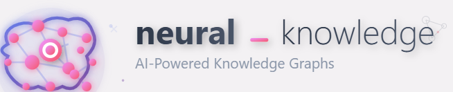
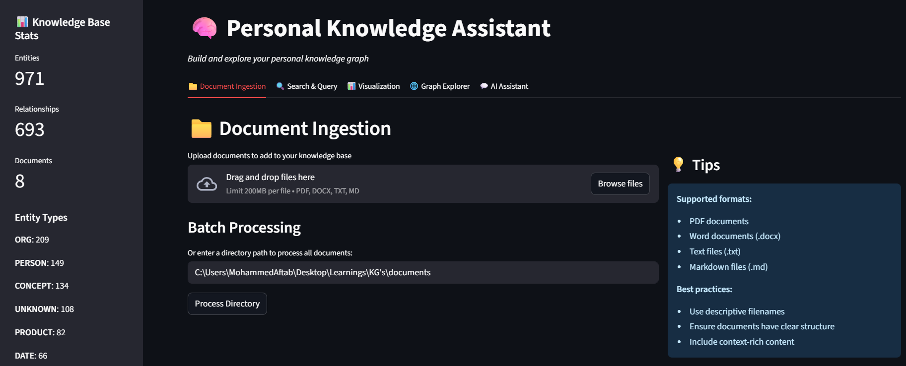
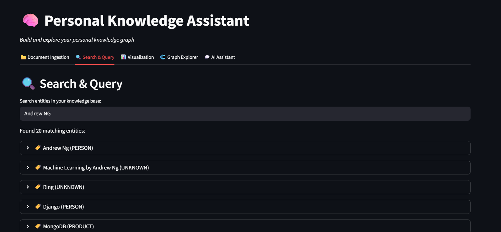
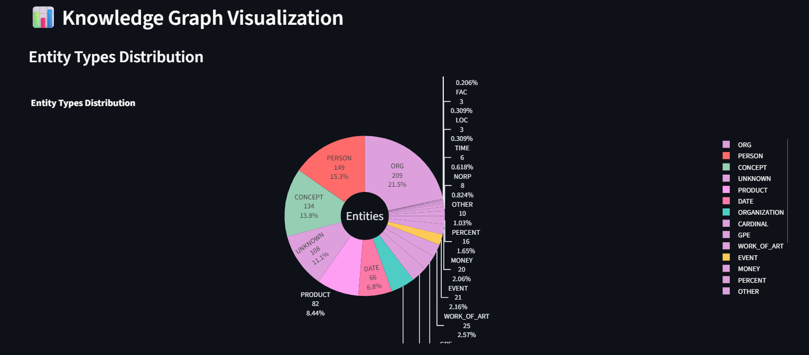
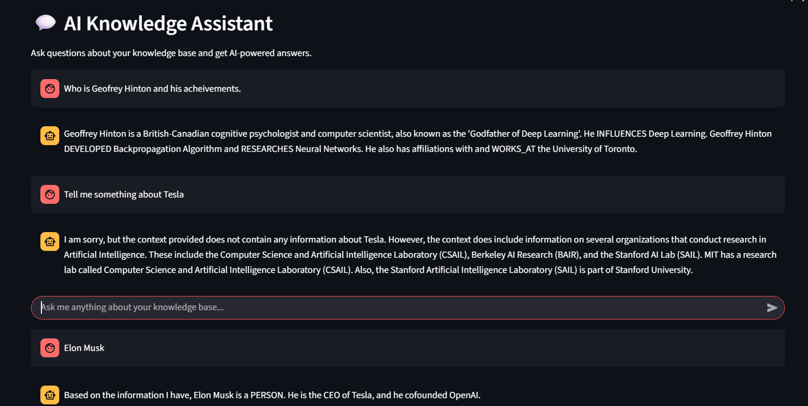
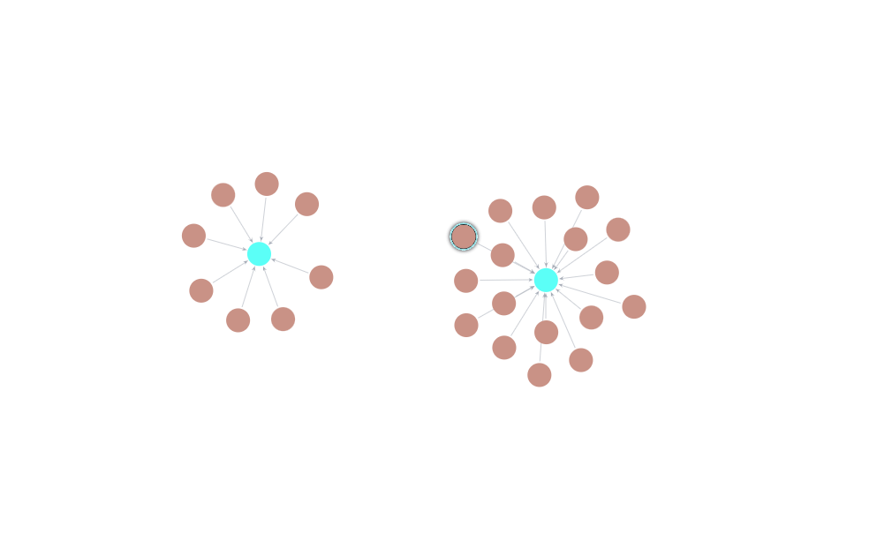
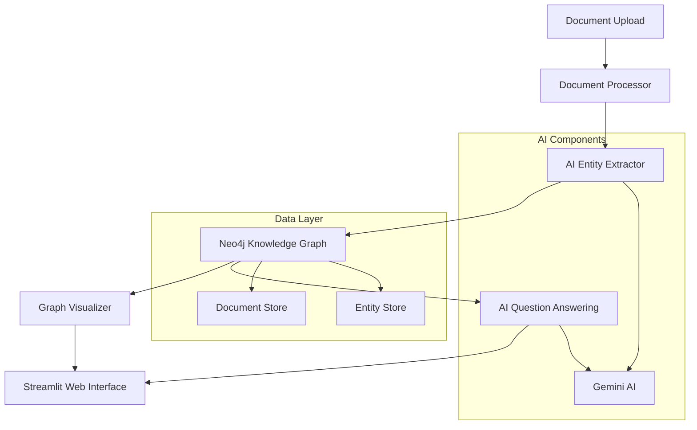

# Personal Knowledge Assistant

> *Transform your documents into an intelligent, queryable knowledge graph powered by AI* 

[](https://www.python.org/downloads/)
[](https://neo4j.com/)
[](https://streamlit.io/) 
[](https://opensource.org/licenses/MIT)
 
## Overview

The Personal Knowledge Assistant is an advanced AI-powered system that transforms your documents into an interactive knowledge graph. It automatically extracts entities, relationships, and concepts from your files, then enables you to explore and query your knowledge base through natural language conversations.

### Key Features

- **Multi-Format Document Processing** - Supports PDF, DOCX, TXT, and Markdown files
- **Intelligent Entity Extraction** - AI-powered identification of people, organizations, concepts, and relationships
- **Interactive Knowledge Graph** - Neo4j-powered graph database with rich visualizations
- **Natural Language Q&A** - Ask questions and get AI-generated answers based on your documents
- **Real-time Visualization** - Interactive graph explorer with filtering and zoom capabilities
- **Advanced Search** - Semantic search across entities and relationships
- **Analytics Dashboard** - Network analysis, centrality metrics, and statistical insights

 







## Demo




*Interactive knowledge graph showing relationships between AI researchers, companies, and institutions*

## Architecture



## Quick Start

### Prerequisites

- **Python 3.8+**
- **Docker** (for Neo4j)
- **Gemini API Key** ([Get one here](https://makersuite.google.com/app/apikey))

### 1. Clone the Repository

```bash
git clone https://github.com/yourusername/personal-knowledge-assistant.git
cd personal-knowledge-assistant
```

### 2. Set Up Environment

```bash
# Create virtual environment
python -m venv venv

# Activate virtual environment
# On Windows:
venv\Scripts\activate
# On macOS/Linux:
source venv/bin/activate

# Install dependencies
pip install -r requirements.txt

# Download spaCy model
python -m spacy download en_core_web_sm
```

### 3. Start Neo4j Database

```bash
# Start Neo4j container
docker run --name neo4j-knowledge-assistant \
  -p 7474:7474 -p 7687:7687 \
  -d \
  -v neo4j_data:/data \
  -v neo4j_logs:/logs \
  -e NEO4J_AUTH=neo4j/password \
  neo4j:latest
```

### 4. Configure API Key

```bash
# Set environment variable
export GEMINI_API_KEY="your_gemini_api_key_here"

# Or create .env file
echo "GEMINI_API_KEY=your_gemini_api_key_here" > .env
```

### 5. Launch the Application

```bash
# Start the web interface
streamlit run knowledge_assistant.py -- --gemini-api-key $GEMINI_API_KEY --web
```

Open your browser to `http://localhost:8501` and start building your knowledge graph! 🎉

## 📚 Usage Guide

### Document Ingestion

The system supports multiple document formats:

- **📄 PDF Files** - Research papers, reports, books
- **📝 Word Documents** - Meeting notes, documentation
- **📋 Text Files** - Plain text content
- **📖 Markdown Files** - Technical documentation, README files

#### Via Web Interface

1. Navigate to the **"Document Ingestion"** tab
2. Drag and drop files or use the file picker
3. Click **"Process Documents"**
4. Watch as entities and relationships are extracted in real-time

#### Via Command Line

```bash
# Process a single document
python knowledge_assistant.py --gemini-api-key YOUR_KEY --ingest document.pdf

# Process an entire directory
python knowledge_assistant.py --gemini-api-key YOUR_KEY --ingest /path/to/documents/
```

### Exploring Your Knowledge Graph

#### Interactive Visualization

- **Filter by entity types** - Focus on people, organizations, or concepts
- **Search specific entities** - Find and center on particular nodes
- **Analyze network metrics** - Discover central and influential entities
- **Customize display** - Adjust node size, colors, and layout

#### Search and Discovery

```bash
# Search for entities
"Find information about Tesla"
"Who are the AI researchers mentioned?"
"What companies are in Silicon Valley?"
```

#### Natural Language Q&A

Ask complex questions about your knowledge base:

- *"Who works at Google and what are their contributions?"*
- *"What are the relationships between Stanford and Silicon Valley companies?"*
- *"Tell me about the history of artificial intelligence research"*
- *"Which venture capital firms invested in which companies?"*

## Entity Types and Relationships

### Extracted Entity Types

| Type | Description | Examples |
|------|-------------|----------|
| **PERSON** | Individuals, researchers, executives | "Geoffrey Hinton", "Elon Musk" |
| **ORGANIZATION** | Companies, institutions, labs | "Google", "Stanford University" |
| **LOCATION** | Places, cities, regions | "Silicon Valley", "Palo Alto" |
| **CONCEPT** | Ideas, technologies, methodologies | "Machine Learning", "Deep Learning" |
| **EVENT** | Meetings, conferences, milestones | "IPO", "Product Launch" |
| **PRODUCT** | Software, hardware, services | "ChatGPT", "Tesla Model S" |

### Relationship Types

- **WORKS_AT** - Employment relationships
- **FOUNDED** - Company/organization founding
- **INVESTED_IN** - Investment relationships
- **LOCATED_IN** - Geographic relationships
- **RESEARCHES** - Research focus areas
- **COLLABORATED_WITH** - Professional collaborations
- **ACQUIRED** - Acquisition relationships

## Technical Details

### AI-Powered Entity Extraction

The system uses a sophisticated multi-stage approach for entity extraction:

1. **spaCy NER** - Initial entity detection using statistical models
2. **LLM Enhancement** - Gemini AI for context-aware entity refinement
3. **Relationship Detection** - AI-powered relationship extraction between entities
4. **Duplicate Resolution** - Intelligent merging of similar entities

### Knowledge Graph Storage

- **Database**: Neo4j graph database for optimal relationship storage and querying
- **Indexing**: Full-text search indexes on entity names and descriptions
- **Constraints**: Uniqueness constraints to prevent data duplication
- **Relationships**: Typed, directional relationships with metadata

### Visualization Engine

- **Plotly.js** - Interactive graph visualizations with zoom, pan, and filter
- **NetworkX** - Graph layout algorithms and network analysis
- **D3.js Integration** - Custom graph metrics and centrality calculations

## Analytics and Insights

### Network Analysis Metrics

- **Degree Centrality** - Most connected entities
- **Betweenness Centrality** - Entities that bridge different communities
- **Closeness Centrality** - Entities with shortest paths to others
- **Clustering Coefficient** - Measure of local connectivity
- **Community Detection** - Identification of entity clusters

### Statistical Dashboard

- Entity type distributions
- Relationship frequency analysis
- Document coverage metrics
- Temporal trend analysis (when dates are available)

## 🔧 Configuration

### Environment Variables

```bash
# Required
GEMINI_API_KEY=your_gemini_api_key

# Optional
NEO4J_URI=bolt://localhost:7687
NEO4J_USER=neo4j
NEO4J_PASSWORD=password
STORAGE_DIR=knowledge_base
```

### Advanced Configuration

#### Entity Extraction Tuning

```python
# Customize entity types in knowledge_assistant.py
CUSTOM_ENTITY_TYPES = [
    "PERSON", "ORGANIZATION", "TECHNOLOGY", 
    "RESEARCH_AREA", "PUBLICATION", "PATENT"
]

# Adjust extraction parameters
CHUNK_SIZE = 2500  # Text chunk size for processing
CONFIDENCE_THRESHOLD = 0.7  # Minimum confidence for relationships
```

#### Graph Visualization Settings

```python
# Customize visualization in KnowledgeGraphVisualizer
COLOR_PALETTE = {
    'PERSON': '#FF6B6B',
    'ORGANIZATION': '#4ECDC4',
    'CONCEPT': '#96CEB4',
    'LOCATION': '#45B7D1'
}

# Layout parameters
LAYOUT_ALGORITHM = 'spring'  # or 'kamada_kawai', 'circular'
NODE_SIZE_RANGE = (10, 30)
EDGE_WIDTH_RANGE = (1, 5)
```

## 🧪 Development and Testing

### Running Tests

```bash
# Run comprehensive tests
python test_knowledge_assistant.py

# Test specific components
python test_entity_extraction.py
python test_graph_operations.py
python test_ai_assistant.py
```

### Development Setup

```bash
# Install development dependencies
pip install -r requirements-dev.txt

# Enable pre-commit hooks
pre-commit install

# Run code formatting
black knowledge_assistant.py
flake8 knowledge_assistant.py
```

### Adding New Document Types

```python
# Extend DocumentProcessor class
class CustomDocumentProcessor(DocumentProcessor):
    def _extract_custom_format(self, file_path):
        # Implement custom extraction logic
        return extracted_text
    
    def process_file(self, file_path):
        if file_path.suffix.lower() == '.custom':
            return self._extract_custom_format(file_path)
        return super().process_file(file_path)
```

## 🔌 API Reference

### Core Classes

#### PersonalKnowledgeAssistant

```python
assistant = PersonalKnowledgeAssistant(
    gemini_api_key="your_key",
    neo4j_uri="bolt://localhost:7687",
    neo4j_user="neo4j",
    neo4j_password="password"
)

# Ingest documents
assistant.ingest_document("path/to/document.pdf")
assistant.ingest_directory("path/to/documents/")

# Query the knowledge base
answer = assistant.answer_question("Who founded Google?")
results = assistant.search_knowledge_base("artificial intelligence")

# Get statistics
stats = assistant.get_statistics()
```

#### Neo4jKnowledgeGraph

```python
graph = Neo4jKnowledgeGraph(uri, user, password)

# Add entities and relationships
graph.add_entity(Entity(name="John Doe", type="PERSON"))
graph.add_relationship(Relationship(
    source="John Doe", 
    target="Google", 
    relation_type="WORKS_AT"
))

# Query the graph
entities = graph.search_entities("Google")
details = graph.get_entity_details("John Doe")
subgraph = graph.get_subgraph(["Google", "Stanford"])
```

### REST API Endpoints

The system can be extended with a REST API:

```python
# Example API endpoints
GET /api/entities                    # List all entities
GET /api/entities/{name}            # Get entity details
POST /api/documents                 # Upload document
GET /api/search?q={query}           # Search entities
POST /api/query                     # Ask natural language question
GET /api/graph/subgraph             # Get graph data for visualization
```

##  Deployment

### Production Deployment

#### Docker Compose

```yaml
version: '3.8'
services:
  neo4j:
    image: neo4j:latest
    ports:
      - "7474:7474"
      - "7687:7687"
    environment:
      NEO4J_AUTH: neo4j/your_password
    volumes:
      - neo4j_data:/data

  knowledge-assistant:
    build: .
    ports:
      - "8501:8501"
    environment:
      GEMINI_API_KEY: your_api_key
      NEO4J_URI: bolt://neo4j:7687
    depends_on:
      - neo4j

volumes:
  neo4j_data:
```

#### Cloud Deployment

**Neo4j Aura + Streamlit Cloud**

1. Create a Neo4j Aura instance
2. Deploy to Streamlit Cloud
3. Configure secrets in Streamlit dashboard

**AWS/GCP/Azure**

- Use managed Neo4j instances
- Deploy with container orchestration (EKS, GKE, AKS)
- Configure auto-scaling and load balancing

### Performance Optimization

#### For Large Document Collections

```python
# Batch processing configuration
BATCH_SIZE = 10  # Process documents in batches
PARALLEL_WORKERS = 4  # Parallel document processing
CHUNK_OVERLAP = 200  # Text chunk overlap for better context

# Neo4j performance tuning
dbms.memory.heap.max_size=4G
dbms.memory.pagecache.size=2G
dbms.checkpoint.interval.time=300s
```

#### Caching Strategy

```python
# Implement caching for frequent queries
from functools import lru_cache

@lru_cache(maxsize=1000)
def cached_entity_search(query):
    return knowledge_graph.search_entities(query)
```

## 🤝 Contributing

We welcome contributions! Here's how to get started:

### Contribution Guidelines

1. **Fork the repository**
2. **Create a feature branch** (`git checkout -b feature/amazing-feature`)
3. **Write tests** for your changes
4. **Ensure code quality** (black, flake8, mypy)
5. **Update documentation** as needed
6. **Submit a pull request**

### Areas for Contribution

- **New document format support** (Excel, PowerPoint, etc.)
- **Enhanced entity extraction** (domain-specific models)
- **Advanced analytics** (temporal analysis, sentiment analysis)
- **Visualization improvements** (3D graphs, VR interface)
- **Performance optimizations** (caching, parallel processing)
- **Internationalization** (multi-language support)

### Development Roadmap

- [ ] **Multi-language support** (Spanish, French, German)
- [ ] **Temporal knowledge graphs** (time-aware relationships)
- [ ] **Collaborative knowledge bases** (multi-user support)
- [ ] **Advanced visualizations** (3D graphs, VR/AR interfaces)
- [ ] **Integration APIs** (Slack, Discord, Microsoft Teams)
- [ ] **Mobile application** (iOS and Android apps)
- [ ] **Voice interface** (speech-to-text queries)

## Use Cases

### Academic Research

- **Literature Review Management** - Track papers, authors, and research trends
- **Citation Analysis** - Understand research lineages and influential works
- **Collaboration Discovery** - Find potential research partners and institutions

###  Corporate Knowledge Management

- **Employee Expertise Mapping** - Identify subject matter experts and skills
- **Project Documentation** - Maintain institutional knowledge across projects
- **Competitive Intelligence** - Track industry trends and competitor activities

### Journalism and Investigations

- **Source Relationship Mapping** - Understand connections between people and organizations
- **Story Development** - Discover narrative threads and related events
- **Fact Checking** - Verify claims against documented evidence

### Research and Development

- **Patent Landscape Analysis** - Map technological developments and innovations
- **Vendor Relationship Management** - Track partnerships and supply chains
- **Market Research** - Analyze industry players and market dynamics

## Limitations and Considerations

### Current Limitations

- **Language Support** - Currently optimized for English text
- **Entity Extraction Accuracy** - Depends on document quality and domain
- **Scalability** - Performance may degrade with very large document collections (10,000+ documents)
- **Real-time Updates** - Knowledge graph updates are not instantaneous

### Privacy and Security

- **Data Processing** - Documents are processed locally with optional cloud LLM calls
- **API Keys** - Gemini API calls may send text snippets to Google's servers
- **Local Deployment** - For maximum privacy, use local LLM models (future feature)

### Best Practices

- **Document Quality** - Use well-structured, text-heavy documents for best results
- **Regular Backups** - Export knowledge graphs periodically
- **Incremental Updates** - Process new documents regularly rather than in large batches
- **Quality Control** - Review extracted entities and relationships for accuracy

##  Troubleshooting

### Common Issues

#### "Neo4j Connection Failed"
```bash
# Check if Neo4j is running
docker ps | grep neo4j

# Restart Neo4j container
docker restart neo4j-knowledge-assistant

# Check logs
docker logs neo4j-knowledge-assistant
```

#### "Entity Extraction Failed"
```bash
# Check API key
echo $GEMINI_API_KEY

# Verify spaCy model
python -c "import spacy; spacy.load('en_core_web_sm')"

# Check document format
file your_document.pdf
```

#### "Graph Visualization Not Loading"
```bash
# Clear browser cache
# Check browser console for JavaScript errors
# Verify Streamlit is running on correct port
```

### Performance Issues

#### Slow Document Processing
- Reduce chunk size in entity extraction
- Process documents individually rather than in batches
- Use more powerful hardware or cloud instances

#### Graph Visualization Lag
- Limit number of nodes displayed (< 500 for optimal performance)
- Use graph filtering to focus on relevant entities
- Consider upgrading to more powerful hardware

##  Additional Resources

### Documentation

- [Neo4j Documentation](https://neo4j.com/docs/)
- [Streamlit Documentation](https://docs.streamlit.io/)
- [Gemini AI Documentation](https://ai.google.dev/docs)
- [spaCy Documentation](https://spacy.io/usage)

### Research Papers

- ["Knowledge Graphs: Methodology, Tools and Selected Use Cases"](https://doi.org/10.1007/978-3-030-00668-6)
- ["A Survey on Knowledge Graph Embedding: Approaches, Applications and Benchmarks"](https://doi.org/10.1016/j.eswa.2020.113250)
- ["Natural Language Processing for Information Extraction"](https://www.aclweb.org/anthology/)


## License

This project is licensed under the MIT License - see the [LICENSE](LICENSE) file for details.

##  Acknowledgments

- **Neo4j Team** - For the excellent graph database platform
- **Google AI** - For the powerful Gemini language models  
- **Streamlit Team** - For the intuitive web framework
- **spaCy Team** - For the robust NLP library
- **Open Source Community** - For the countless libraries and tools that make this project possible


